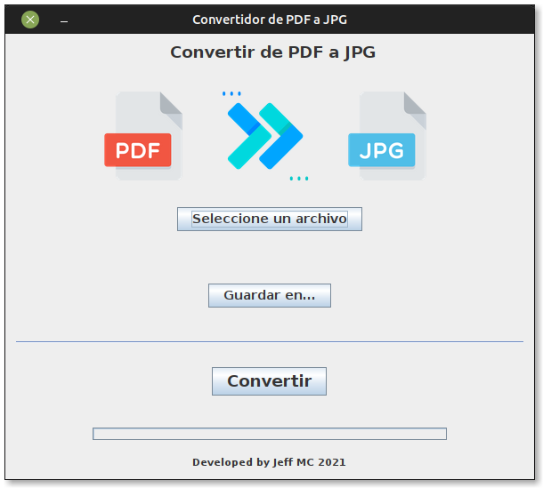
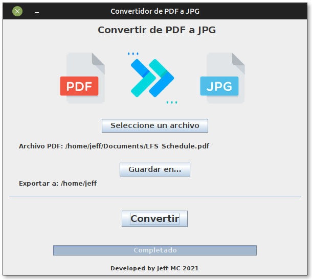

# Programa que convierte archivos PDF a imágenes JPG

## Consideraciones

* Creado en Ubuntu MATE 20.04
* Netbeans 12.5
* OpenJDK 16.0.1

## Librerías externas

* pdfbox 2.0.24
* fontbox 2.0.24
* commons-logging 1.2

Las librerías se incluyen en el directorio del proyecto.

## Capturas

